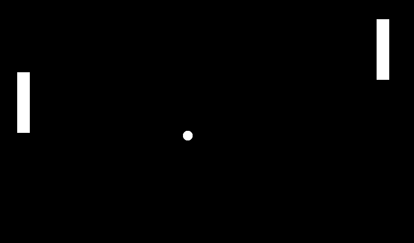

# Aether

### 🔥 [Try it online!](https://oxxide216.github.io/aether)

Lisp-like interpreted functional programming language.

Still in active development, only for Linux and WebAssembly for now.

## Features

- **WASM VM**: Runs anywhere WebAssembly runs (browsers, Node.js)
- **Smart Memory**: Automatic arena allocation (no GC pauses, no manual management)
- **Lisp Macros**: Full hygienic macro system
- **Graphics API**: Built-in OpenGL 2D rendering
- **REPL**: Interactive development environment
- **Optimize it all!!!** - Built-in COW + DCE optimizations
- **Development speed** From `git init` to wasm target + HTTP server + web framework + graphics library in 90 days

## Why Aether?

### Full Stack in One Language

Same code runs as:
 - Native HTTP server (Linux)
 - Web app (browser via WASM)
 - CLI tools

## Dependencies

- **C compiler**
- **Bash**

That's it!

## Quick start

### Linux

```shell
git clone https://github.com/oxxide216/aether --recursive
cd aether
./build.sh
./install.sh
echo "(println 'Hello, World!')" > main.ae
aether main.ae
```

### Repl
```shell
aether
```

## WebAssembly

### Build Aether

#### Linux

```shell
EMCC_PATH=[emcc] WASM=on ./build.sh
WASM=on ./install.sh
```

Where:
- [emcc] - your Emscripten installation path

### Build your project

```shell
aether-web-setup [out]
aether -c [out]/app.abc [src]
```

Where:
- [out] - directory for generated bundle
- [src] - your Aether source file

Then just start http server inside of [out] directory (you can write it in Aether too)!

## Built-in graphics

#### Linux

```shell
GLASS=on ./build.sh
./install.sh
```

## Examples

Check out [examples](examples) for:
- hello-world.ae - you know it
- fl.ae - TUI file manager
- web - basic website built with Aether + WebAssembly
- And other stuff!

## Screenshots



## ❤️ Support

 - ⭐ Star the repo (helps visibility!)
 - 🐛 [Report Issues](https://github.com/oxxide216/aether/issues)
 - 🏗️ Contribute - help to improve this project!
